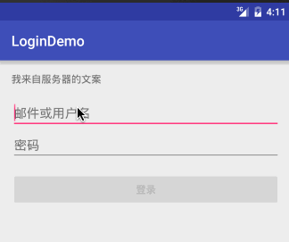

# LoginDemo4DataBinding

本项目实现了一个简单的登录页面。

效果如下图：

  
 功能很简单：只有当输入用户名和密码的长度都大于 6 时，登录按钮才是可点击的（即 Button 的 enabled 属性为 true）。

工程中共有 2 个 module：

- app， 使用非 DataBinding 技术实现；
- databinding，使用 DataBinding 技术实现；

我们可以通过该项目直观的感受到 DataBinding 技术所带来的变化。

更多关于 DataBinding 的信息，请阅读我的博客：[安卓 Data Binding 使用方法总结（姐姐篇）](http://blog.csdn.net/zhaizu/article/details/51491455)。

